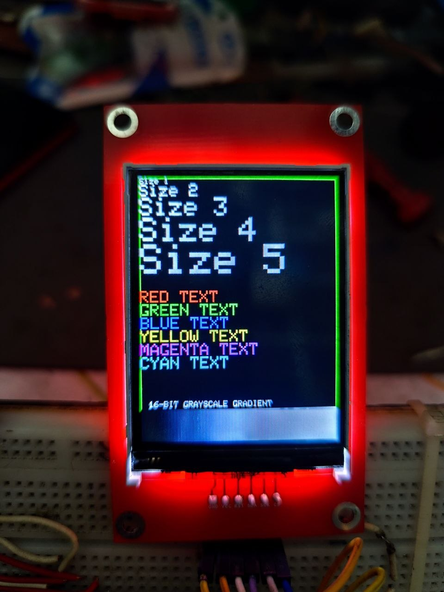
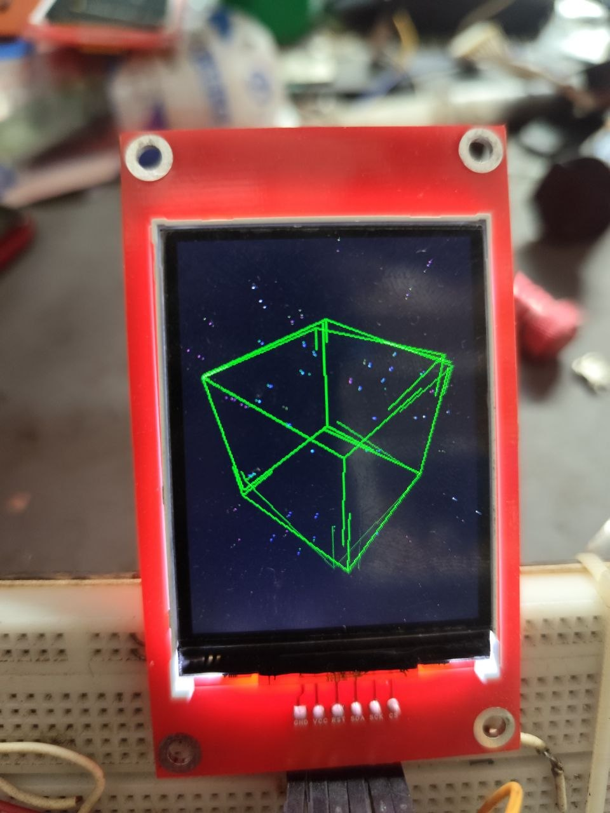
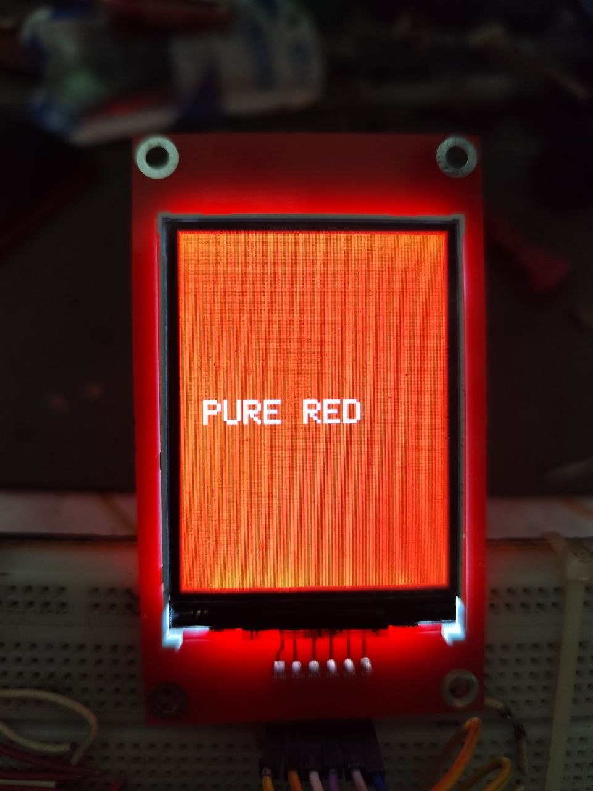
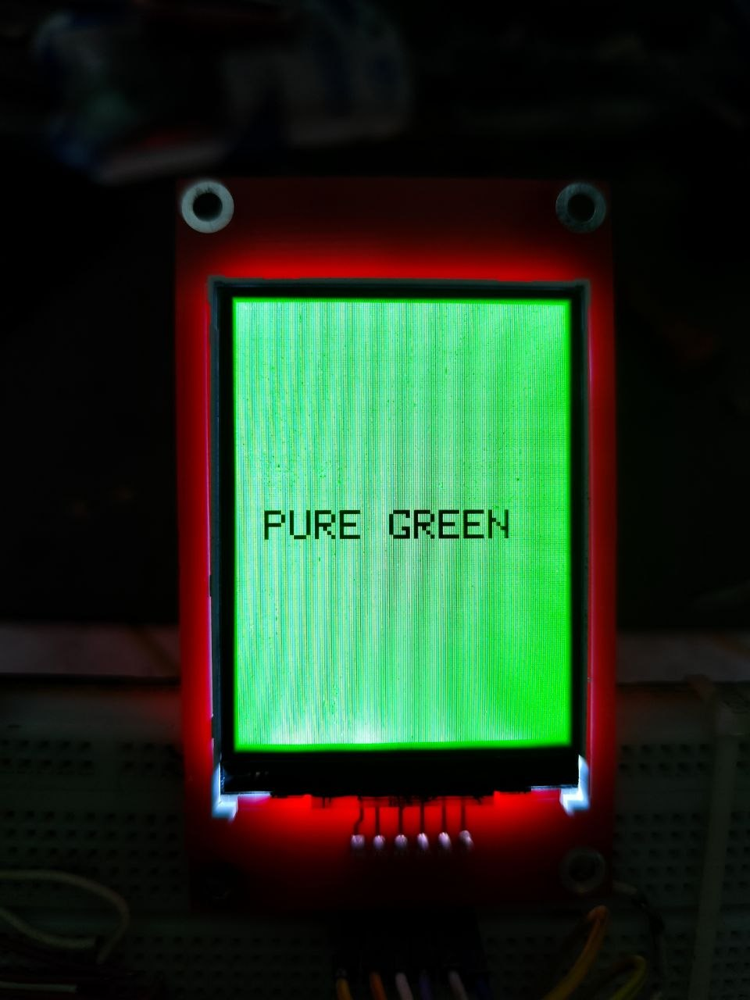
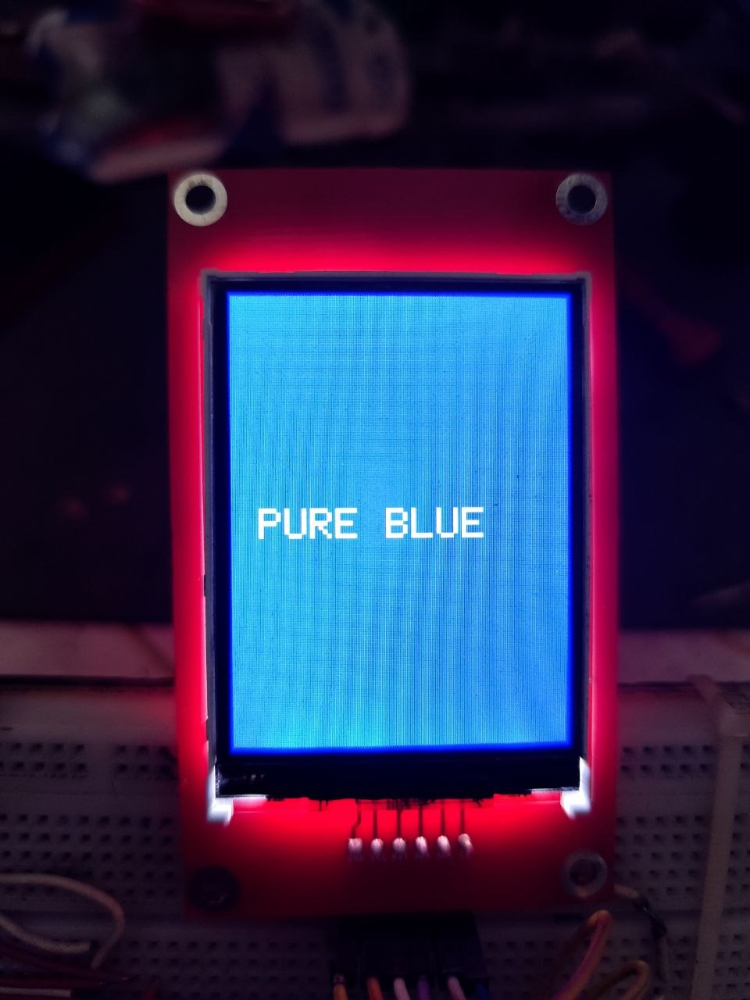
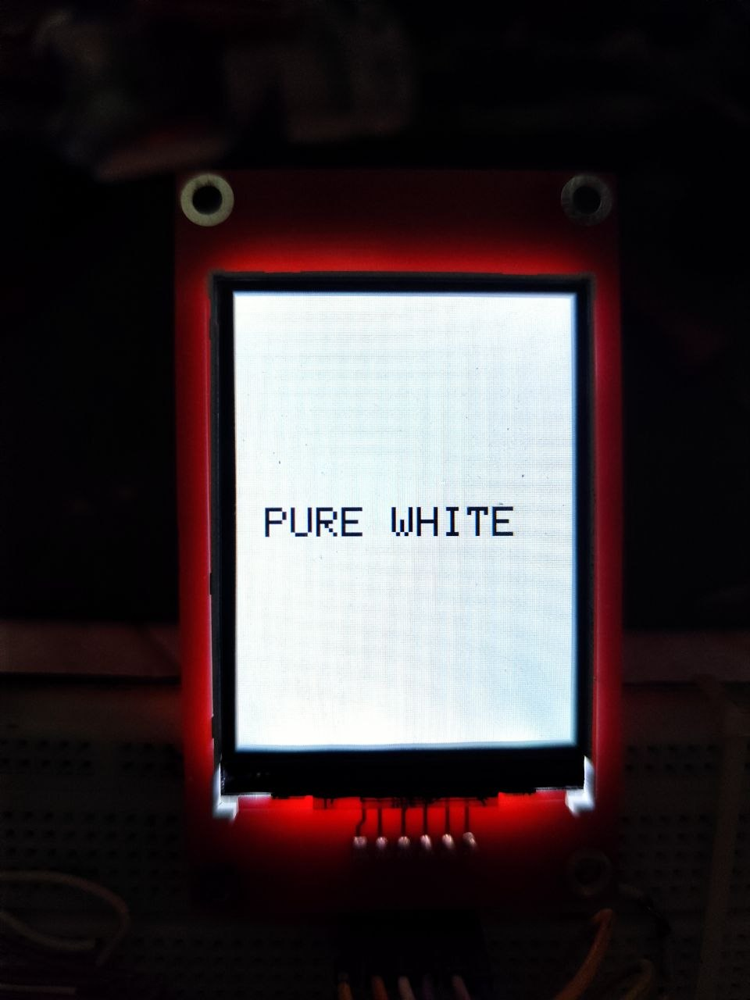
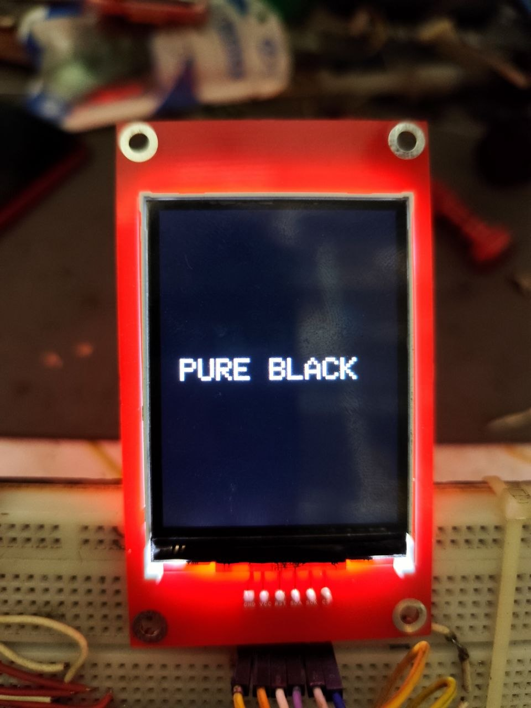

# 📱 Custom TFT Display for ESP32 / ESP8266 / STM32 / Raspberry Pi Pico

A compact and high-performance SPI TFT display module designed for embedded systems and IoT projects.

Supports multiple platforms and works smoothly with **Arduino_GFX_Library**.

---

## 🔥 Features

* ✅ 2.4" / 2.8" TFT Display
* ✅ SPI Interface (High Speed)
* ✅ Multi-platform Support
     * ESP32
     * ESP8266
     * STM32
     * Raspberry Pi Pico
* ✅ Smooth UI Rendering
* ✅ Custom UI / OS Compatible
* ✅ Compact & Professional Design

---

## 🛠️ Applications

* IoT Dashboard (Smart Home, Automation)
* WiFi Scanner / Packet Monitor
* Custom UI Systems
* Sensor Data Visualization
* Debugging Tools
* Portable Embedded Devices

---

## 🔌 Pin Configuration (SPI)

| Display Pin | MCU Pin (Example ESP32) |
| ----------- | ----------------------- |
| GND         | GND                     |
| VCC         | 3.3V                    |
| RST         | GPIO4                   |
| SDA (MOSI)  | GPIO23                  |
| SCK         | GPIO18                  |
| CS          | GPIO5                   |

---

## 📚 Library Required

Install from Arduino Library Manager:

* **Arduino_GFX_Library**

---

## 🧪 Tested On

* ESP32 Dev Board
* ESP8266 NodeMCU
* STM32 (SPI mode)
* Raspberry Pi Pico

---

## 🎮 Example Projects

This repository includes multiple demo projects to test performance and features:

### 🚀 3D Cube & Starfield Demo

* Smooth 3D rendering
* Starfield animation
* High FPS SPI performance

### 🎨 Color Test

* Display color accuracy test
* RGB rendering check

### 🧪 Ultimate Color & Text Test

* Font rendering
* UI layout testing
* Multi-size text display

---

## ▶️ How to Run Examples

1. Open any example folder
2. Open `.ino` file in Arduino IDE
3. Select your board (ESP32 / ESP8266 / etc.)
4. Upload and enjoy 🚀

---

## 📸 Demo Preview

## 📸 Demo Preview

## 📸 Demo Preview

  
  

  
  
  

  
  

## 📩 Contact

For custom design / bulk order / support:
**S.K. Electronics and Repair**
https://www.facebook.com/SKElectronicsandRepair/

---

⭐ If you like this project, don't forget to star the repo!
